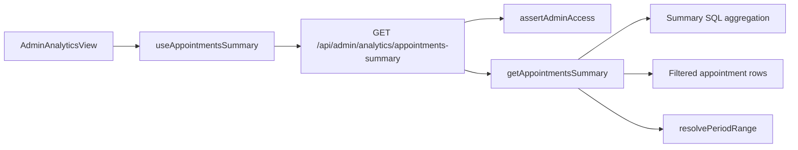

# Admin Appointments Analytics

Technical reference for the clinic admin **Appointments Summary** dashboard (`/admin/analytics`).

## Architecture



### Route access

| Path | Role |
|------|------|
| `/admin` | Admin dashboard overview (current week KPIs) |
| `/admin/analytics` | Appointments Summary charts |
| `/admin/*` | `admin` only |
| `/doctor/*` | `doctor` only |
| `/dashboard`, `/appointments/*` | `patient` only |

Middleware enforces portal separation via `src/config/routes.ts` and `src/middleware.ts`.

## Status derivation

The schema stores `CONFIRMED` and `CANCELLED` only. Metrics are derived as:

| Metric | Rule |
|--------|------|
| Scheduled | `CONFIRMED` and `startsAt > now` |
| Completed | `CONFIRMED` and `startsAt <= now` |
| Cancelled | `CANCELLED` |
| No-show | Not tracked yet (returns `0`) |

All bucketing uses clinic timezone `Asia/Kolkata` (`CLINIC_TIMEZONE`).

## Period filters

| Granularity | Range | Buckets |
|-------------|-------|---------|
| `daily` (default) | Current calendar week (Mon–Sun) | One bar per day |
| `weekly` | Last 8 weeks including current | One bar per week |
| `monthly` | Last 6 months including current | One bar per month |

## API

### `GET /api/admin/analytics/appointments-summary`

**Auth:** session cookie, `admin` role required.

**Query**

| Param | Type | Default | Values |
|-------|------|---------|--------|
| `granularity` | string | `daily` | `daily`, `weekly`, `monthly` |

**Response `200`**

```json
{
  "period": {
    "granularity": "daily",
    "from": "2026-08-18T00:00:00.000+05:30",
    "to": "2026-08-25T00:00:00.000+05:30"
  },
  "summary": {
    "total": 124,
    "scheduled": 18,
    "completed": 98,
    "cancelled": 8,
    "noShow": 0,
    "completionRate": 79.0,
    "cancellationRate": 6.5
  },
  "byStatus": [
    {
      "status": "scheduled",
      "label": "Scheduled",
      "count": 18,
      "percentage": 14.5
    }
  ],
  "series": [
    {
      "label": "Mon 18",
      "scheduled": 2,
      "completed": 5,
      "cancelled": 1,
      "noShow": 0,
      "total": 8
    }
  ]
}
```

**Errors**

| Status | When |
|--------|------|
| `401` | Not signed in |
| `403` | Signed in but not admin |

## Frontend

- Chart library: **Recharts** (stacked bar + donut)
- Default filter: **Daily** (current week)
- Tooltips show count and percentage per status

## Seed credentials

After `pnpm db:seed`:

| Role | Email | Password |
|------|-------|----------|
| Admin | `admin@healthmate.com` | `Admin@123` |

Historical seed rows use booking references prefixed with `HM-SEED-` for analytics charts.

## Confluence

Upload this document (and an architecture diagram export) to your Confluence space and link it from the user story.
